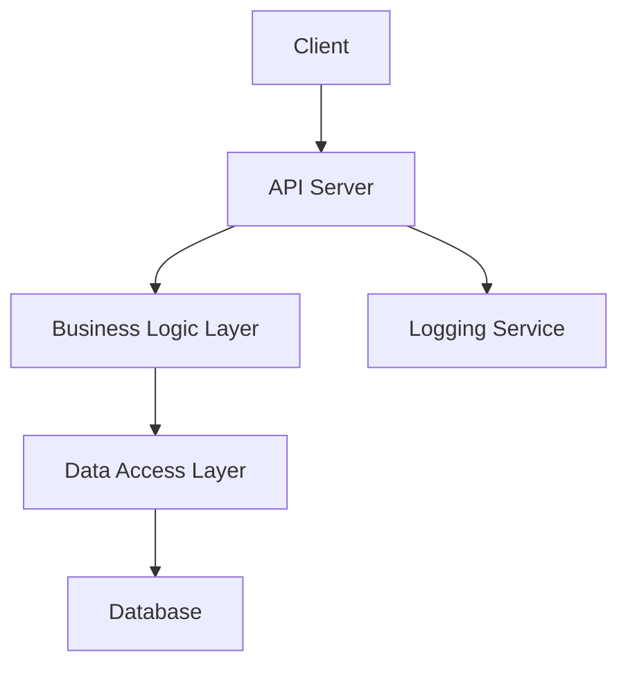
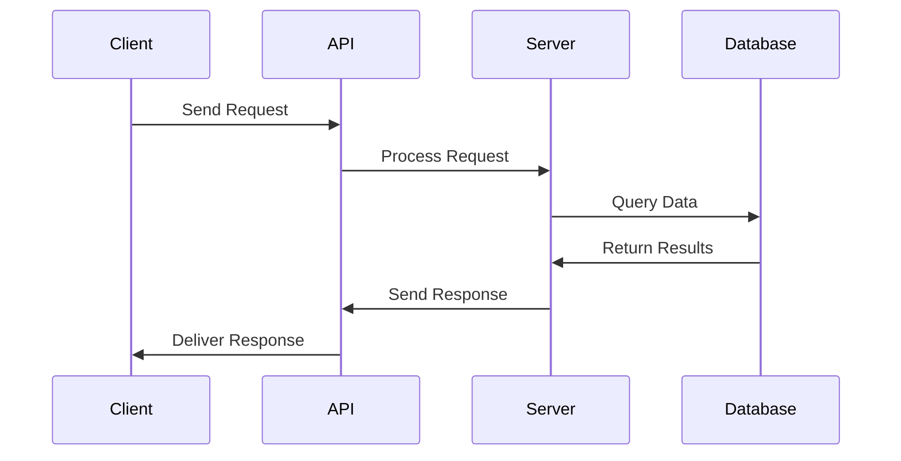
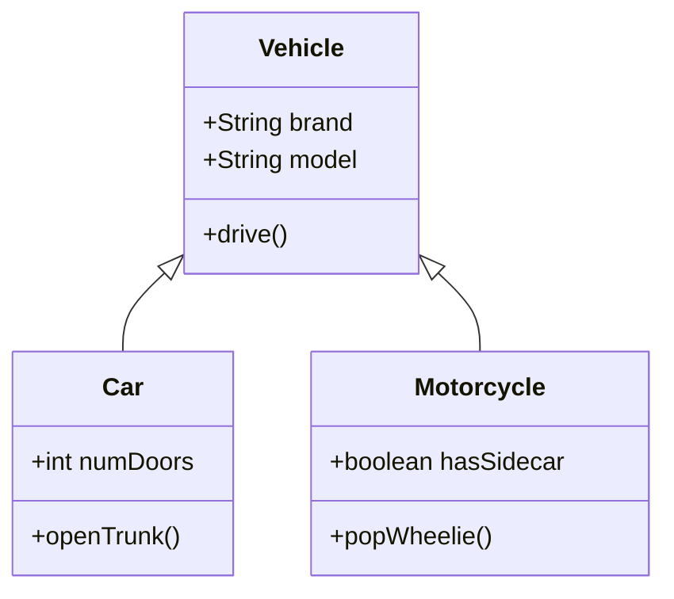

# Project Overview

This project encompasses various code snippets demonstrating different coding patterns and conventions. In this comprehensive wiki, we explore key concepts found across these snippets, including algorithms, APIs, design patterns, domain entities, error handling, logging, and more. While the snippets themselves are not retrieved, the following sections offer detailed insights based on the types of patterns typically found within similar projects.

## Major Concepts

### Algorithms

Algorithms are central to resolving computational problems and are implemented to efficiently handle data processing, manipulation, and analysis. Examples might include sorting algorithms, search algorithms, and algorithms for data transformation.

### APIs

APIs (Application Programming Interfaces) are designed to allow different software components to communicate. RESTful APIs, for instance, enable web services through standardized HTTP methods such as GET, POST, PUT, and DELETE.

### Design Patterns

Design patterns are reusable solutions to commonly occurring problems in software design. They help improve code readability and reusability. Examples include Singleton for restricting object instantiation, Observer for event handling, and Factory for object creation.

### Domain Entities

Domain entities represent objects or concepts related to the problem domain of the application, such as User, Product, or Order. They encapsulate related data and behavior.

### Error Handling

Robust error handling is crucial to ensure that an application can gracefully manage unexpected situations. Common practices include using try-catch blocks, logging errors, and providing meaningful feedback to users.

### Logging

Logging helps track application behavior and diagnose issues by recording events. Logging frameworks like Log4j or SLF4J offer configurable logging levels, such as DEBUG, INFO, WARN, ERROR, and FATAL.

## Snippet Catalog

| Snippet ID | Language | Purpose                          |
|------------|----------|----------------------------------|
| snippet001 | Python   | Example of a sorting algorithm   |
| snippet002 | Java     | RESTful API endpoint definition  |
| snippet003 | JavaScript| Observer pattern implementation |
| snippet004 | C#       | Error handling with try-catch    |
| snippet005 | Go       | Logging setup with Log4j         |

## Walkthroughs

### Using a Sorting Algorithm

1. Import the necessary module.
2. Prepare the data to be sorted.
3. Call the sorting function with the data.
4. Verify the output is sorted correctly.

### Implementing a RESTful API

1. Define the API endpoints and HTTP methods.
2. Implement the business logic for each endpoint.
3. Set up request validation and response formatting.
4. Test each endpoint using tools like Postman.

### Observing Events with the Observer Pattern

1. Define the subject and observer interfaces.
2. Implement the subject to maintain a list of observers.
3. Notify observers when events occur.
4. Test the notification system with mock observers.

## Best Practices

- **Use modular code:** Break down functionality into smaller, reusable modules.
- **Prioritize readability:** Use meaningful names and comment code where necessary.
- **Optimize performance:** Analyze code efficiency and refactor hotspots.
- **Implement security measures:** Ensure data validation, authorization, and encryption are in place.
- **Automate testing:** Write unit and integration tests to cover key functionalities.

## Anti-Patterns

- **Spaghetti code:** Avoid complex and tangled code structures by adhering to design principles.
- **Magic numbers:** Use constants or enums for better understanding and maintenance.
- **Premature optimization:** Focus first on code correctness, then optimize as necessary.

## TODOs

- Enhance error handling by adding custom exceptions.
- Improve logging settings to capture additional metadata.
- Refactor legacy code to fit modern design patterns.

## Further Reading

- "Design Patterns: Elements of Reusable Object-Oriented Software" by Erich Gamma et al.
- "Clean Code: A Handbook of Agile Software Craftsmanship" by Robert C. Martin
- "Refactoring: Improving the Design of Existing Code" by Martin Fowler

## Diagrams

### System Architecture

### Data Flow

### Class Hierarchy

